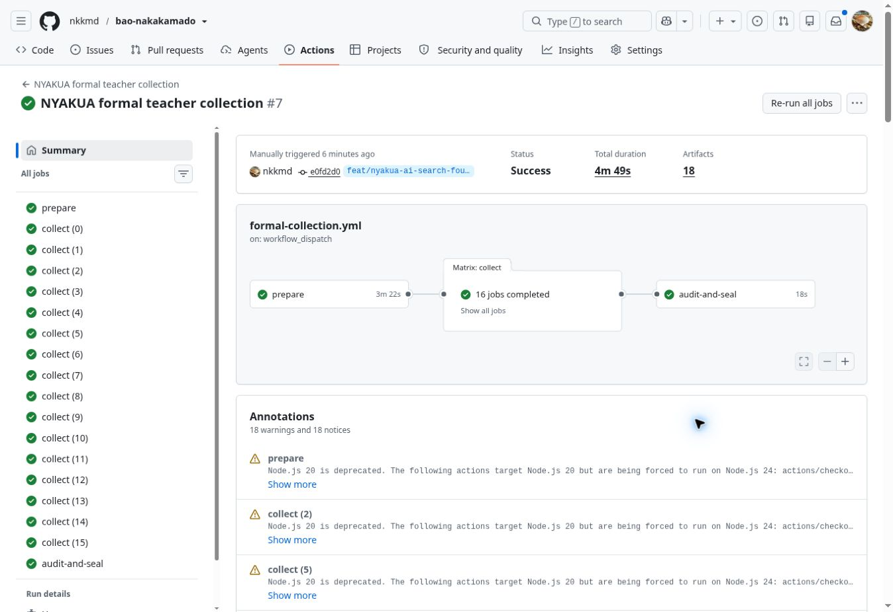

# 正式教師収集v2の実行・監査・封印記録

記録日：2026年10月5日（日本時間）。[workflow登録の記録](AI_FORMAL_COLLECTION_ACTIVATION_20261005.md)の後続。

2026年10月5日09:00:36 JSTに [正式収集run 37245789837](https://github.com/nkkmd/bao-nakakamado/actions/runs/37245789837)、attempt 1を一度だけ手動起動した。対象は `feat/nyakua-ai-search-foundation-20261004`、head `e0fd2d0b9f09d8b47d7770e95817bb01a62b7718`。入力は `collection_version: v2`、新規収集の `resume_receipts: []`。起動前にアカウントnkkmdと収集用secretが未登録であることを確認し、独立した32byteの暗号学的乱数鍵をbase64で `BAO_COLLECTION_KEY_BASE64` に新規登録した。既存鍵の上書きは行っていない。値は会話・git・記録・画像に含めない。

## 固定条件と進行状態

対象config IDは `NAKAKAMADO-FORMAL-COLLECTION-20261005-v2`。最大8192要求・16shard、教師は実時計深度4・静止探索1・5000ms。規則v0.8.0・棋譜version 7・入力368bitを維持する。検証済みCIと同じソースと候補選択を使い、結果に応じてsplit・seed・必要層・採用基準を変更しない。

期待する候補計画digestは `891329b4e865c97591211072acb18db53022a9704fb0dc7fd0dd479c70600a03`、ソースdigestは `4e4d3acfbcfb5de5c9bf7e77accd8b3dbd26649389c0ab06471a025275d0cdac`、除外一覧digestは `eda140703e63bc813c2284427e2b471312f103c0ffb0cdfcbdfa36f0d4827a3c`。

prepare job `111563314965` は成功した。実ログの `keyLoaded: true`、`prepared: true`、8192要求、上記計画digestとの一致を確認した。候補不足ゲート・現在ソース・除外一覧の照合を通過し、16分割の実時計収集へ進んだ。各collect jobには固定計画と収集鍵を引き継ぎ、新規receiptのため途中復元は要求していない。

全16shard・全8192要求が完了した。各shardの実ログで512件完了・512件新規計測・再利用0件と計画digestの一致を確認し、合計8192件の新規計測を照合した。prepare・collect×16・audit-and-sealの全18ジョブ成功。画面上の総所要時間は4分49秒、runの完了更新は09:05:25 JST。

全体監査の判定は `READY-FOR-TRAINING-DESIGN`。深度4の完了など固定したラベル基準に適合した教師要求は8192/8192件、受理率100%、不採用理由なし、採用後の局面・入力重複／split間漏洩0件。これは固定予算の有限深度教師ラベルの受理であり、最適手・棋力・学習器の品質の証明ではない。[機械可読の実行記録](AI_FORMAL_COLLECTION_RUN_V2_20261005.json)に、run/attempt/head・全job・各shardの実計測・公開可能な監査summary・18artifactのIDとZIP digestを保存する。

| 確認項目 | train | validation |
|---|---:|---:|
| 採用行数 | 5019 | 1517 |
| 開幕group | 2296 | 707 |
| MTAJI | 640 | 160 |
| 確保分のみ | 20 | 5 |
| 終局線 | 645 | 190 |
| 終局線上限による除外 | 0 | 0 |
| 必要層の不足 | 0 | 0 |

行数・開幕group・全必要層を通過し、終局線は両splitとも20%以内。finalは必要条件の通過だけを公開する。局面・入力・ラベル・層別件数を表示していない。

finalのデータdigestは `1750a34d21bcc824133b23647033317fbcb7894cdac70625c0c45b6622ec2a03`、暗号文SHA-256は `ad4fd4dfda9699841159953607047c40d9c59831e8b26ed619f02ff76fa210a8`。詳細監査digestは `a2f34f7fcffbbac7e6b794c9dbb3cd82f312b90695bf248e24fa6206782a1098`。finalと詳細監査は暗号化したまま保存され、開封は行っていない。

## 保存と次工程

収集後の監査はすべて通過した。`formal-dataset` artifact IDは `11319211802`、ZIP digestは `sha256:63faac0ac801104167409b25a09f37d73bfa84d51ccae8e0d2f0bf09857555fc`。train/validation、通常のsummary、封印済みfinal・詳細監査を含む。元の候補計画と全16shardのartifactも保持する。各ZIPのID・digest・期限はAPIメタデータとして固定し、この工程では別環境でのZIPダウンロード・復元を実施したとは扱わない。保存期限は2026年11月4日（期限の厳密な時刻はJSONのexpiresAtを参照）。

次は学習器・モデル比較・validationの数値基準を正式評価前に固定する。正式に受理したtrain/validationを使用し、閲覧済み開発パイロットを正式finalへ混ぜない。モデルとvalidation条件を固定して合格した後にだけ、既存の一度だけの開封手順を使用する。本学習・モデル採用・最終開封・棋力評価・公開AI差し替えは未実施である。

中断時は[起動・再開・封印手順](AI_FORMAL_COLLECTION_LAUNCH_20261005.md)に従い、元の全完了shardと途中checkpointを固定receiptで復元する。計測済みの不採用ラベルも保持し、未完了要求だけを実行する。鍵・版・ソース・計画を維持する。採用後の結果は別の完了記録として残す。

説明文はCC BY-SA 4.0、機械可読記録の保護対象部分はMIT。[出典・ライセンス](../LICENSES.md)、考案者nkkmd、初公開日2026年9月30日を維持する。
