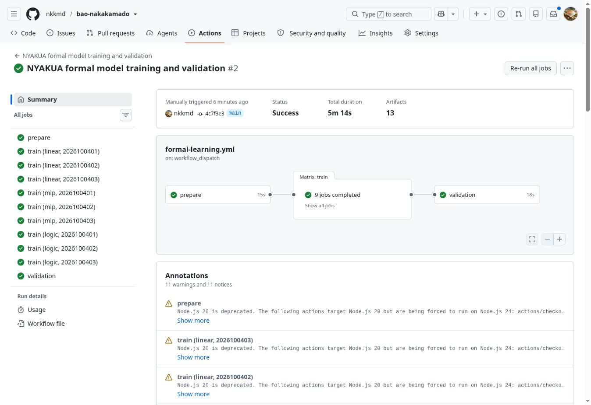

# 正式学習v1の完了と候補モデルの凍結

2026年10月5日（日本時間）。Bao Nakakamado v0.8.0・棋譜version 7。考案者nkkmd、初公開日2026年9月30日を維持する。

正式収集v2を使用した学習と固定条件のvalidationを完了し、**線形・seed 2026100401**を開発候補として凍結した。判定は `CANDIDATE-SELECTED-FINAL-STILL-SEALED`。最終評価データは未開封であり、棋力・実機・公開AI採用の合格を意味しない。

## 実行と初回停止の履歴

| 実行 | 固定commit | 開始・完了確認（JST） | 結果 |
|---|---|---|---|
| [初回run 37253040070](https://github.com/nkkmd/bao-nakakamado/actions/runs/37253040070)、attempt 1 | `ae32c7c8906d6b94768bf8e453a5a0613d4c56af` | 10:51:00開始 | prepare・9学習成功、validationの検証コードで停止、判定報告なし |
| [修正後run 37257277028](https://github.com/nkkmd/bao-nakakamado/actions/runs/37257277028)、attempt 1 | `4c7f3e3132dc191a2eaabe3f41ee43bc22c9ddb8` | 11:55:04開始、12:00:18完了確認 | 全11ジョブ成功、全9候補合格、線形候補を選定 |

PR #18は10:49:12 JSTに統合した。初回のvalidationは整数評価の0と期待値−0をstrict比較して停止した。数学的な反対称性の破れではなく、ゼロ符号の検証不具合である。[修正記録](AI_FORMAL_LEARNING_ZERO_FIX_20261005.md)を保持する。PR #19はNode 9・Python数値6・ZIP境界3の18テスト、開発用の整数評価288件・対称性576件・完全再開6候補、既存の全8 CIジョブを通過し、11:53:52 JSTに統合した。

修正は検証コードと回帰テストに限定し、学習器・整数評価器・元dataset・数値基準・seed・epochを変更しなかった。旧成果のfingerprintを変更せず、修正後は同じ仕様で新規 `resume_receipts: []` を起動した。修正後の学習fingerprintは `872a4690be9cd686ace800052e01b4afda5488c2cae60fb41cbc458a2958045c`。元の収集ソースdigest `4e4d3acfbcfb5de5c9bf7e77accd8b3dbd26649389c0ab06471a025275d0cdac` も維持した。

## データと完了の確認

prepareは元dataset artifact 11319211802のrun/attempt/head・ZIP digest・期限・ファイル構成・CRCを照合した。元の全行digest、通常棋譜再生、368bit入力、教師ラベル、train/validation間の漏洩も検査した。train 5019行は学習workerだけ、validation 1517行・707開幕groupは比較jobへ渡した。MLP・論理ゲートの全6候補は150epoch・23,550更新で完了した。線形は固定ridge解であり、epoch更新は0。

[データ復元receipt](AI_FORMAL_LEARNING_DATASET_RECEIPT_20261005.json)は `restored: true`、`finalExtracted: false`、`finalOpened: false`。収集鍵は使用せず、final・詳細監査を復号しない。ここで確認したのはActionsの別workerへの復元であり、元datasetの独立した長期バックアップの完了ではない。

## 固定基準による比較

主指標は開幕groupのMSEを均等平均した値。表は3seedの中央値であり、単独の最良seedへ差し替えない。

| 構成 | 主指標の3seed中央値 | 手作り基準に対する比率 | 3seed全条件通過 |
|---|---:|---:|---|
| 手作り基準 | 0.1909295654 | 1.0000 | 比較基準 |
| 線形 | 0.0674249985 | 0.3531 | はい・選定 |
| MLP | 0.0682900805 | 0.3577 | はい |
| 論理ゲート | 0.0731807017 | 0.3833 | はい |

9候補すべてが主指標・NAMUA/MTAJI・12層・サイズ・推論時間の基準を通過した。validation 1517行×9候補＝13,653件のPython/Node整数推論は不一致0で、反対側評価の反対称性も通過した。各seed・全体・全12層の数値と全判定は、元artifactの [validation報告](AI_FORMAL_LEARNING_VALIDATION_20261005.json) を改変せず保存する。

線形は3seedの主指標が同一で、固定順位で最小の中央値となった。採用seedは事前に決めた2026100401。教師評価の再現誤差は手作り基準より約64.7%小さいが、同時間探索の勝率や棋力向上の証明ではない。選定モデルは1612 bytes、当該Actions workerの推論中央値は2.572328 µs。実機の速度として扱わない。

## 凍結した成果と保存期限

[候補モデル](../tools/ai-integration/frozen-models/formal-v1-linear-2026100401/model.json)、[学習記録](../tools/ai-integration/frozen-models/formal-v1-linear-2026100401/training.json)、[凍結receipt](../tools/ai-integration/frozen-models/formal-v1-linear-2026100401/receipt.json)を元artifactのbytesで保存した。モデルSHA-256は `f74175fbaa6f2d6a82148cf5e106da7291f396b2b38cb79866dc641b2147254d`。validation報告・学習記録の入力digest・origin・実装fingerprintと一致した。公開画面はこのモデルを読み込まない。

validation報告artifactは11323052570、ZIP digestは `sha256:e2f9b749c59660c3c3973828299cabda392513fd946a9542d5be90dc40a1d328`。選定モデルartifactは11323108219、ZIP digestは `sha256:f485e13761c1918de7083bb734a70acb67a3a4a02f73ca1e48783886b8f9c638`。取得したreceipt・報告・選定モデルのZIP digest、ファイル名、CRCをローカルでも照合した。[実行記録JSON](AI_FORMAL_LEARNING_RUN_20261005.json)に全job・artifact・元runの失敗・各候補の学習完了を保存する。

元datasetの期限は2026年11月4日09:05:21 JST、今回のvalidation報告の期限は同日12:00:15 JST。選定モデル・学習記録・報告・復元receiptはリポジトリへ保存したが、他8候補のcheckpointとtrain/validation本体はActions artifactの期限に従う。期限を越えての再開や再評価には、記録したdigestを維持した別保管が必要である。

## 次の工程

2026年10月5日の後続工程で[最終評価の準備](AI_FORMAL_FINAL_PREPARATION_20261005.md)を整備した。以下は本学習完了時点の順序の原記録。準備完了時点では正式finalは未開封だった。後続の[正式最終評価](AI_FORMAL_FINAL_RUN_20261005.md)は、明示承認後に一度だけ実行し、固定18条件をすべて通過した。この学習時点の候補・数値・手順は原記録として保持する。

候補モデルと今回の基準を固定したまま、最終評価の合否基準・一度だけの開封手順・中断時の記録を整備する。現時点の `authorizedToOpenOnce: false` を保持し、今回の工程では開封用gateを作らない。最終評価を学習・閾値調整へ逆流させない。

候補の探索接続では通常終局と安全停止を維持し、同時間の探索比較・最善手集合への所属・既知の戦術・対局とmoto g52j 5Gを含む実機を別工程で確認する。全3構成の候補条件通過だけを理由に、AI-GEN4と同じ強さ、公開AI採用、ニャクアの先後均衡を主張しない。

説明文はCC BY-SA 4.0。コード・設定・保護対象の機械可読記録はMIT。[出典と利用条件](../LICENSES.md)を維持する。
